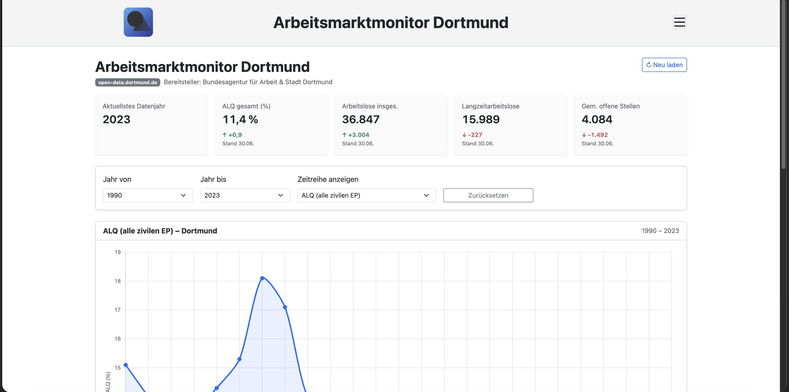
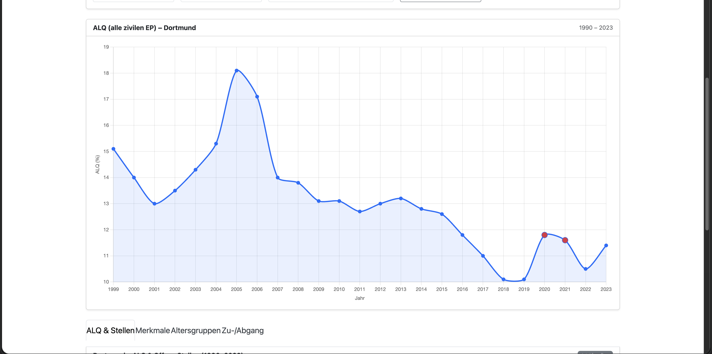
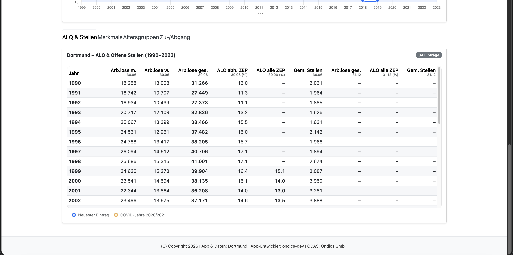

# Arbeitsmarktmonitor - App fuer den Open Data App-Store (ODAS)

Interaktive Visualisierung von Arbeitsmarktkennzahlen fuer den [Open Data App Store](https://open-data-app-store.de/). Entspricht der [Open Data App-Spezifikation](https://open-data-apps.github.io/open-data-app-docs/open-data-app-spezifikation/). Mehr unter https://github.com/open-data-apps

---

## Funktionen







Single Page Application mit Logo, Menue, Impressum/Datenschutz/Kontakt-Seiten und Fusszeile. Die Konfiguration wird vom ODAS geladen. Inhalte:

- **Kennzahlen**: Aktuellstes Datenjahr, ALQ gesamt, Arbeitslose insgesamt, Langzeitarbeitslose, gemeldete offene Stellen
- **Zeitreihe**: Diagramm (Chart.js) fuer ausgewaehlte Kennzahl mit Jahresfilter
- **Tabellenansicht**: Vier Themenbereiche (ALQ/Stellen, Merkmale, Altersgruppen, Zu-/Abgang)
- **Tabellen-Usability**: Sticky Header, eigener Scrollbereich je Tab, hervorgehobene Schluesselspalten
- **Visuelle Marker**: Neuester Eintrag (Neu-Badge) sowie COVID-Jahre 2020/2021 (COVID-Badge)

---

## Fuer wen ist diese App?

Diese App richtet sich an Buergerinnen und Buerger in Dortmund, an die Verwaltung sowie an alle, die sich fuer Arbeitsmarktdaten interessieren. Voraussetzung ist kein spezielles Datenwissen – wer die Arbeitsmarktentwicklung verstehen moechte, kann die App direkt nutzen.

---

## Datenformat

Unterstuetzt **JSON** aus der OpenDataSoft API (`/api/explore/v2.1/catalog/datasets/.../records`).

---

## Datenquellen

Die App nutzt vier Datensaetze aus einer OpenDataSoft-Instanz:

- Arbeitslose, Arbeitslosenquote und offene Stellen seit 1990
- Arbeitslose nach Merkmalen seit 1990
- Arbeitslose nach Altersgruppen seit 1997
- Zu- und Abgang von Arbeitslosen seit 1990

Beispielinstanz: open-data.dortmund.de.

---

## Entwicklung

**Voraussetzungen:** Docker / Docker Compose, Make

```bash
make build up
```

App laeuft auf http://localhost:8090 (Konfiguration wird lokal geladen).

---

## Wichtige Dateien

| Datei                      | Beschreibung                                                                                  |
| -------------------------- | --------------------------------------------------------------------------------------------- |
| `app/app.js`               | Hauptlogik: Laden der OpenDataSoft-Daten, Filter, KPI-Berechnung, Chart und Tabellenrendering |
| `app-package.json`         | App-Metadaten und Instanz-Konfigurationsfelder fuer den ODAS                                  |
| `odas-config/config.json`  | Lokale Instanzkonfiguration fuer Entwicklung und Tests                                        |
| `docker-compose.yml`       | Lokale Laufzeitumgebung (Nginx + gemountete App-Dateien)                                      |
| `assets/odas-app-icon.svg` | App-Icon                                                                                      |

---

## Konfiguration (Instanz)

| Parameter     | Beschreibung                                | Pflicht |
| ------------- | ------------------------------------------- | ------- |
| `titel`       | Anzeigetitel der App                        | ja      |
| `seitentitel` | Browser-Tab-Titel                           | ja      |
| `apiurl`      | Basis-URL zur OpenDataSoft API              | ja      |
| `urlDaten`    | URL zur Datensatz-Seite im Open Data Portal | ja      |
| `sprache`     | Sprache der App (aktuell `de`)              | ja      |

Weitere ODAS-Standardfelder (`kontakt`, `beschreibung`, `impressum`, `datenschutz`, `fusszeile`) werden ueber die Instanzkonfiguration gepflegt.

---

## Betriebsarten

Die App kann lokal, eigenstaendig hinter einem Traefik-Reverse-Proxy oder ueber den ODAS
betrieben werden.

### Datenabruf: `proxyAktiv`

| Wert   | Bedeutung                                                                   |
| ------ | --------------------------------------------------------------------------- |
| `nein` | Direkter Abruf der Daten-URL. Standard fuer Entwicklung und Standalone.      |
| `ja`   | Abruf ueber den ODAS-Proxy `…/odp-data`. Nur im ODAS-Live-System verfuegbar. |

Bei `nein` muss die Datenquelle CORS freigeben.

### Standalone-Betrieb

Voraussetzung: ein laufender Traefik mit dem externen Docker-Netzwerk `proxynet`,
dem EntryPoint `websecure` und dem Zertifikatsresolver `letsencrypt`.

1. In `docker-compose.standalone.yml` den Platzhalter `app1.example.com` durch den
   echten FQDN ersetzen.
2. In `odas-config/config.json` `proxyAktiv` auf `nein` belassen.
3. Starten:

```bash
STANDALONE=true make up
STANDALONE=true make logs
STANDALONE=true make down
```

Im Standalone-Betrieb entfaellt die lokale Portfreigabe; Traefik terminiert TLS und
leitet auf den internen Nginx-Port 80 weiter. Die Konfiguration wird aus derselben
`odas-config/config.json` gelesen wie in der Entwicklung und von Nginx unter `/config`
ausgeliefert.

### Auslieferung an den ODAS

`make zip` erzeugt das Liefer-ZIP mit `app/`, `assets/`, `app-package.json` und
`CHANGELOG.md`. Die Infrastrukturdateien (`Dockerfile`, `docker-compose*.yml`,
`nginx.conf`, `Makefile`) sind nicht Teil der Auslieferung. Das ZIP ist ein Bauartefakt und wird nicht mitversioniert, sondern bei Bedarf mit `make zip` erzeugt.

## Autor

Copyright (C) 2026, Ondics GmbH
